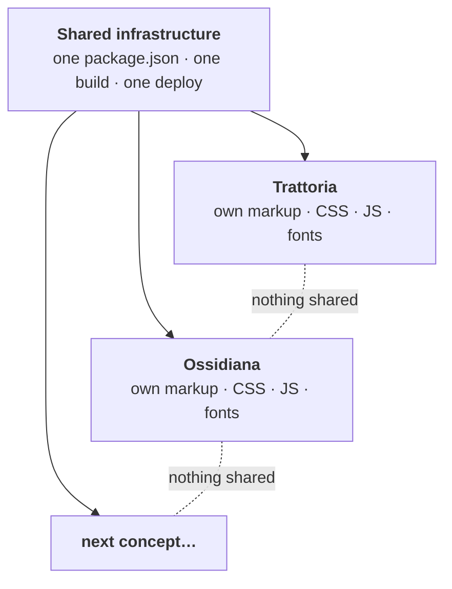

<div align="center">

<picture>
  <source media="(prefers-color-scheme: dark)" srcset="docs/img/loop-logo-on-dark.svg">
  
</picture>


**Full-page homepage concepts for local businesses.<br>Each one designed as if it were the only one on the street.**

[](https://loop-studio-web.github.io/vetrine/)
[](https://github.com/Loop-Studio-Web/vetrine/actions/workflows/deploy.yml)
[](https://astro.build)
[](#the-checklist-every-window-passes)
[](#the-checklist-every-window-passes)

[**Walk the street →**](https://loop-studio-web.github.io/vetrine/)

<sub>The entrance page follows the studio's own brand; each window behind it keeps its own identity.</sub>

</div>

<br>

## The street

*Vetrine* is Italian for **shop windows**. That is the whole idea: a shop window has one job, to make a stranger stop. So every concept here is a complete homepage with its own mood, structure, typography and motion, grouped by business category (Food & drink first), with several archetypes inside each category.

> [!NOTE]
> The pages are in Italian, because that is the audience they are built for. All businesses, people, addresses and reviews are fictional and declared as such.

<br>

### 01 · Trattoria del Borgo

<a href="https://loop-studio-web.github.io/vetrine/ristorazione/trattoria/"></a>

*Honest food, rebuilt for today. Quality without airs.*

| | |
|---|---|
| **Archetype** | The neighbourhood trattoria: warm, young, unpretentious |
| **Mood** | Daylight, terracotta, paper. Light and dark themes with a switcher |
| **Type** | Newsreader for voice, Space Grotesk for everything else |
| **Palette** |  |
| **Signature moves** | Fullscreen video hero with a poster fallback, a "from the kitchen" diary feed, a sample-reviews widget, a table-booking flow, an illustrated SVG map |
| **Lighthouse** | 99 performance on mobile, 100 on accessibility and best practices |

[**Open Trattoria →**](https://loop-studio-web.github.io/vetrine/ristorazione/trattoria/)

<br>

### 02 · Ossidiana

<a href="https://loop-studio-web.github.io/vetrine/ristorazione/grande-ristorante/"></a>

*A dinner in five acts, in a room that stays dark. The light only goes where the plate is.*

| | |
|---|---|
| **Archetype** | The fine-dining tasting-menu restaurant: quiet, theatrical, precise |
| **Mood** | A dark dining room lit one course at a time. Dark only, on purpose |
| **Type** | Bodoni Moda for titles, Jost for text, and an ink-pen script for the chef's notes (ingredient, origin, pairing) |
| **Palette** |  |
| **Signature moves** | A spotlight that follows the cursor (and drifts on its own on touch), a five-course journey on native scroll-snap with edge hints, a very slow in-view zoom on every photo, an "Atlante" of producers with an SVG map and season tabs |
| **Lighthouse** | 97 performance on mobile, 100 on desktop, 100 on accessibility and best practices |

[**Open Ossidiana →**](https://loop-studio-web.github.io/vetrine/ristorazione/grande-ristorante/)

<br>

### Next on the street

| Category | Archetype | Status |
|---|---|---|
| Food & drink | Home restaurant | Planned |
| Food & drink | RistoPub | Planned |
| Legal & professional | to be decided | Planned |
| Beauty & wellness | to be decided | Planned |
| Local shop / e-commerce | to be decided | Planned |

No deadlines: one window at a time, with the care each one needs.

<br>

## The one rule

> [!IMPORTANT]
> **Nothing is shared between concepts.** Not a component, not a layout, not a stylesheet, not a font pairing.
>
> This repository is only infrastructure: one `package.json`, one build, one deploy. It is **not** a design system, and that is deliberate. The failure mode we are avoiding is *N concepts that are really the same site wearing different colours*.



A piece of code is reused between two concepts only when it is the *exact same technical problem solved the exact same way*, never as a principle. Each concept is free to pick its own technique: plain CSS, vanilla JS, or a framework as an Astro island, whatever that page needs.

<br>

## The checklist every window passes

Before a concept goes on the street, it has to clear the same gate:

| Gate | What it means | Trattoria | Ossidiana |
|---|---|:-:|:-:|
| **Builds** | `astro build` is clean | ✅ | ✅ |
| **Accessible** | `axe-core`: zero violations | ✅ | ✅ |
| **Narrow** | No horizontal scroll at 390 px | ✅ | ✅ |
| **Interactive** | Widgets are exercised end to end (forms, tabs, keyboard) | ✅ | ✅ |
| **Shareable** | A 1200×630 `og:image` that previews properly | ✅ | ✅ |
| **Discreet** | `noindex, nofollow`, fictional data, no third-party logos | ✅ | ✅ |

```text
 LIGHTHOUSE · mobile            Trattoria                Ossidiana
 Performance      ████████████████████  99   ███████████████████▌  97
 Accessibility    ████████████████████ 100   ████████████████████ 100
 Best practices   ████████████████████ 100   ████████████████████ 100
 SEO              ████████████▌         63   ████████████▌         63
                  SEO is 63 on purpose: every page ships noindex.
```

<br>

## Behind the counter

**Stack:** [Astro](https://astro.build) (static output), plain CSS with scoped styles, small vanilla-JS scripts per section, images optimised by `astro:assets`. Hosted on GitHub Pages.

```text
src/
├─ pages/
│  ├─ index.astro                      the public hub (see src/hub/)
│  └─ ristorazione/
│     ├─ trattoria/index.astro         page shell only
│     └─ grande-ristorante/index.astro
├─ hub/                                data, styles and sections of the hub page
├─ concepts/
│  ├─ trattoria/                       one component per section + base.css
│  └─ ossidiana/                       same idea, different everything
└─ assets/<concept>/ and hub/          local images only, no hotlinking
public/images/<concept>/               fixed URLs: og:image, favicon
docs/img/                              the pictures you are looking at
```

**Conventions**
- One component per section, with its own markup, scoped CSS and JS.
- Images live in the repo and go through `<Image>`; photos come from Unsplash's free library and are checked for watermarks.
- Every internal URL goes through the configured `base`, otherwise links break on GitHub Pages.
- Reviews and booking widgets are re-created inside each concept with its own styling, never imported.

**Run it**

```bash
npm install
npm run dev        # http://localhost:4321/vetrine/
npm run build      # static output in dist/
npm run preview    # serve the production build locally
```

Node 22.12 or newer.

**Deploy:** every push to `main` triggers a GitHub Actions workflow that builds the site and publishes it to GitHub Pages. There are no manual steps. Because it is a project site, `astro.config.mjs` sets both `site` and `base: '/vetrine'`.

<br>

## Fine print

- 🎭 **Everything is fictional.** Names, addresses, phone numbers, chefs, producers and reviews are invented and labelled as examples. Review widgets carry no third-party branding.
- 🔒 **Nothing leaves the page.** Booking forms are demonstrations: no data is sent or stored.
- 🙈 **Not for search engines.** Every page is `noindex, nofollow`.
- 📷 **Photos** are from [Unsplash](https://unsplash.com) and used under its licence. Brand marks and emblems are AI-assisted concepts created for these demos.

<br>

## The studio

<div align="center">

<picture>
  <source media="(prefers-color-scheme: dark)" srcset="docs/img/loop-logo-on-dark.svg">
  
</picture>

**Website, content and social: three services, one loop.**

[theloopstudio.org](https://theloopstudio.org/) · [Lab: experiments and components](https://github.com/Loop-Studio-Web/lab)

<sub>Spotted a bug or have an idea for the next window? Open an issue.</sub>

</div>
