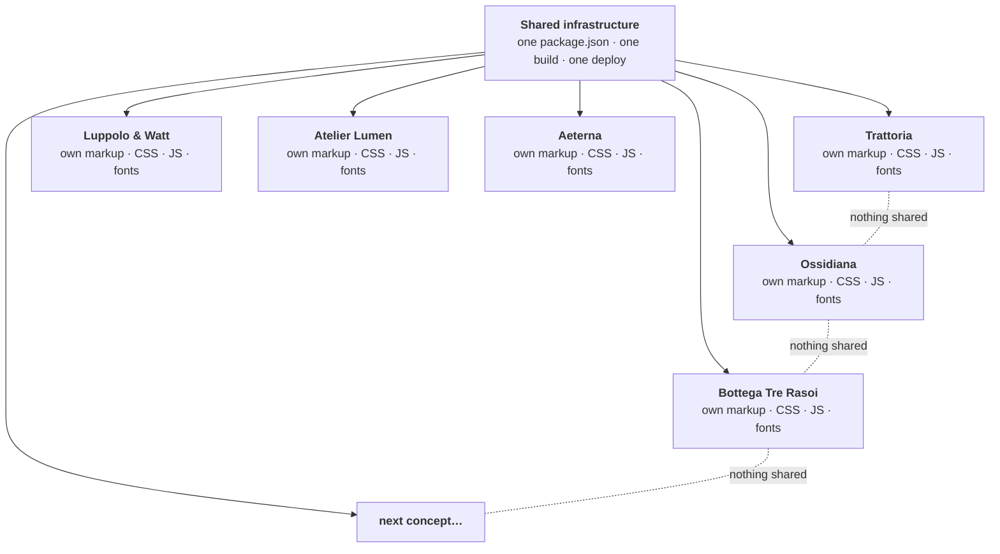

<div align="center">

<picture>
  <source media="(prefers-color-scheme: dark)" srcset="docs/img/loop-logo-on-dark.svg">
  
</picture>


**Full-page homepage concepts for local businesses.<br>Each one designed as if it were the only one on the street.**

[](https://vetrine.theloopstudio.org/)
[](https://github.com/Loop-Studio-Web/vetrine/actions/workflows/deploy.yml)
[](https://astro.build)
[](#the-checklist-every-window-passes)
[](#the-checklist-every-window-passes)

[**Walk the street →**](https://vetrine.theloopstudio.org/)

<sub>The entrance page follows the studio's own brand; each window behind it keeps its own identity.</sub>

</div>

<br>

## The street

*Vetrine* is Italian for **shop windows**. That is the whole idea: a shop window has one job, to make a stranger stop. So every concept here is a complete homepage with its own mood, structure, typography and motion, grouped by business category (Food & drink first), with several archetypes inside each category.

> [!NOTE]
> The pages are in Italian, because that is the audience they are built for. All businesses, people, addresses and reviews are fictional and declared as such.

**How the entrance is organised.** The street is grouped by category: one labelled row of windows per category (a horizontal scroller on phones, with a neon arrow hinting that it moves), and categories still without a concept collect in a final "coming soon" row. Below it, the full list can be filtered by category (the filter lives in the URL hash, so it can be shared) and every concept has an indexable detail page at `/<category>/<archetype>/info/` that explains the idea, who it is for and what is inside. The concepts themselves stay `noindex`. Links from the hub to a concept open in a new tab, so the street stays open while visitors explore.

<br>

### 01 · Trattoria del Borgo

<a href="https://vetrine.theloopstudio.org/ristorazione/trattoria/"></a>

*Honest food, rebuilt for today. Quality without airs.*

| | |
|---|---|
| **Archetype** | The neighbourhood trattoria: warm, young, unpretentious |
| **Mood** | Daylight, terracotta, paper. Light and dark themes with a switcher |
| **Type** | Newsreader for voice, Space Grotesk for everything else |
| **Palette** |  |
| **Signature moves** | Fullscreen video hero with a poster fallback, a "from the kitchen" diary feed, a sample-reviews widget, a table-booking flow, an illustrated SVG map |
| **Lighthouse** | 99 performance on mobile, 100 on accessibility and best practices |

[**Open Trattoria →**](https://vetrine.theloopstudio.org/ristorazione/trattoria/)

<br>

### 02 · Ossidiana

<a href="https://vetrine.theloopstudio.org/ristorazione/grande-ristorante/"></a>

*A dinner in five acts, in a room that stays dark. The light only goes where the plate is.*

| | |
|---|---|
| **Archetype** | The fine-dining tasting-menu restaurant: quiet, theatrical, precise |
| **Mood** | A dark dining room lit one course at a time. Dark only, on purpose |
| **Type** | Bodoni Moda for titles, Jost for text, and an ink-pen script for the chef's notes (ingredient, origin, pairing) |
| **Palette** |  |
| **Signature moves** | A spotlight that follows the cursor (and drifts on its own on touch), a five-course journey on native scroll-snap with edge hints, a very slow in-view zoom on every photo, an "Atlante" of producers with an SVG map and season tabs |
| **Lighthouse** | 97 performance on mobile, 100 on desktop, 100 on accessibility and best practices |

[**Open Ossidiana →**](https://vetrine.theloopstudio.org/ristorazione/grande-ristorante/)

<br>

### 03 · Luppolo & Watt

<a href="https://vetrine.theloopstudio.org/ristorazione/ristopub/"></a>

*Beer that plays. Eight taps brewed in-house, sandwiches eaten by hand, live music on the small stage.*

| | |
|---|---|
| **Archetype** | The brewpub with a stage: loud, warm, a little rough |
| **Mood** | A beer label crossed with a gig poster: kraft paper, amber, ink, hard offset shadows. One light theme with a dark "stage" section |
| **Type** | Big Shoulders Display for titles, Archivo for text |
| **Palette** |  |
| **Signature moves** | A mobile menu that *pours*: the panel fills with beer from the bottom, with foam and bubbles. A tap board with filters and expandable beers (a glass that fills, bitterness and strength bars). "Goes with…" links from each dish that open the right beer. A gig calendar computed from today, so it never goes stale, whose "Book" button pre-fills the booking form. A fermenter that fills while a day counter climbs. A beer-mug cursor companion (mouse only) and a sub-second pour-the-logo intro, once per session |
| **Lighthouse** | 99 performance on mobile, 100 on desktop, 100 on accessibility and best practices |

[**Open Luppolo & Watt →**](https://vetrine.theloopstudio.org/ristorazione/ristopub/)

<br>

### 04 · Bottega Tre Rasoi

<a href="https://vetrine.theloopstudio.org/benessere/barbiere/"></a>

*Cut, beard and razor, without hurry. You take a number, like at the shop.*

| | |
|---|---|
| **Archetype** | The neighbourhood barber: the **low-key** tier of the Beauty & wellness window |
| **Mood** | A bright shop, not a hipster cliché: cream, bottle green and brass, a striped pole, a price board on the wall. A dark "closing time" theme on a switch |
| **Type** | Fraunces for titles, Figtree for text |
| **Palette** |  |
| **Signature moves** | Booking *by turn*: pick service, chair, day and time, then a numbered ticket is "printed" with the summary. Three numbered chairs, also pinned on the photo of the room, each with the next free slot computed from today. A mobile menu that unrolls like a hot towel. A pointer that *is* a pair of scissors (half open, wide open on links, shut while pressing) and a scrollbar striped like the pole |
| **Lighthouse** | 95 performance on mobile, 100 on desktop, 100 on accessibility and best practices |

[**Open Bottega Tre Rasoi →**](https://vetrine.theloopstudio.org/benessere/barbiere/)

<br>
### 05 · Atelier Lumen

<a href="https://vetrine.theloopstudio.org/benessere/estetica/"></a>

*Skin has a light. We find it again. You choose the moment, we do the rest.*

| | |
|---|---|
| **Archetype** | The beauty centre built around light: the **medium** tier of the Beauty & wellness window, a step up in motion and interaction from the barber |
| **Mood** | One day of light, dawn to evening: powder pink, peach, ivory, rose gold and plum. Every section has its own hour and its own colours |
| **Type** | Cormorant for titles, DM Sans for text |
| **Palette** |  |
| **Signature moves** | A **bespoke ritual builder**: three choices (skin, time, what you want) recompose the treatment step by step, with duration, price and a changing colour of light, and the result lands pre-selected in the booking form. A sundial in the nav that reads the hour from how far you have scrolled, and a halo of light that follows the mouse. Treatment cards that tilt in 3D with a moving sheen, filtered by zone. Three cabins that expand one at a time. Booking by *bands of light* with a sun crossing the sky and a printed "ticket of light". A mobile menu that opens like curtains onto the light |
| **Lighthouse** | 99 performance on mobile, 100 on desktop, 100 on accessibility and best practices |

[**Open Atelier Lumen →**](https://vetrine.theloopstudio.org/benessere/estetica/)

<br>


### 06 · Aeterna

<a href="https://vetrine.theloopstudio.org/benessere/longevity/"></a>

*Longevity is measured, and it is designed. A DNA helix in 3D, a bio-assessment and a suite to book.*

| | |
|---|---|
| **Archetype** | The longevity clinic: the **high-key** tier of the Beauty & wellness window, where the budget buys real-time graphics, more code and more interaction than the barber and the beauty centre |
| **Mood** | A laboratory at night: abyss blue, emerald and a thread of gold, with pale "ice" sections as rhythm. Dark by choice |
| **Type** | Sora for titles, JetBrains Mono for data, Cinzel for the wordmark only |
| **Palette** |  |
| **Signature moves** | A **WebGL DNA helix** (Three.js, custom GLSL: chromatic dispersion on every point, depth of field, repulsion from the pointer, inertia) that unwinds as you scroll, with an SVG poster for slow phones and no-WebGL. A pinned section whose protocols **scroll sideways** while you scroll down, each with a technical drawing and a **magnifying lens** that follows the mouse. A **four-step bio-assessment** whose radar chart redraws live on every answer and ends in a report that pre-fills the booking. A **before/after cellular scanner** drawn in canvas, with a draggable blade of light and live readouts. A **suite booking** with real-time price and a side drawer. Magnetic buttons, a contextual cursor ring, glass cards lit by the pointer, a laser-scan mobile menu. Smooth scrolling on desktop only, never on touch |
| **Lighthouse** | 88 performance on mobile, 96 on desktop, 100 on accessibility and best practices. Three.js loads after the first paint on desktop and only after the first touch on phones |

[**Open Aeterna →**](https://vetrine.theloopstudio.org/benessere/longevity/)

<br>

### Next on the street

| Category | Archetype | Status |
|---|---|---|
| Legal & professional | to be decided | Planned |
| Local shop / e-commerce | to be decided | Planned |

No deadlines: one window at a time, with the care each one needs.

<br>

## The one rule

> [!IMPORTANT]
> **Nothing is shared between concepts.** Not a component, not a layout, not a stylesheet, not a font pairing.
>
> This repository is only infrastructure: one `package.json`, one build, one deploy. It is **not** a design system, and that is deliberate. The failure mode we are avoiding is *N concepts that are really the same site wearing different colours*.



A piece of code is reused between two concepts only when it is the *exact same technical problem solved the exact same way*, never as a principle. Each concept is free to pick its own technique: plain CSS, vanilla JS, or a framework as an Astro island, whatever that page needs.

<br>

## The checklist every window passes

Before a concept goes on the street, it has to clear the same gate:

| Gate | What it means | Trattoria | Ossidiana | Luppolo & Watt | Tre Rasoi | Lumen | Aeterna |
|---|---|:-:|:-:|:-:|:-:|:-:|:-:|
| **Builds** | `astro build` is clean | ✅ | ✅ | ✅ | ✅ | ✅ | ✅ |
| **Accessible** | `axe-core`: zero violations | ✅ | ✅ | ✅ | ✅ | ✅ | ✅ |
| **Narrow** | No horizontal scroll at 390 px | ✅ | ✅ | ✅ | ✅ | ✅ | ✅ |
| **Menu on phones** | A real menu with its own open/close effect, keyboard and Escape friendly (a curtain for Ossidiana, an unrolling card for the Trattoria, a pour of beer for Luppolo & Watt, a hot towel for Tre Rasoi, curtains for Lumen, a laser scan for Aeterna) | ✅ | ✅ | ✅ | ✅ | ✅ | ✅ |
| **Interactive** | Widgets are exercised end to end (forms, tabs, keyboard) | ✅ | ✅ | ✅ | ✅ | ✅ | ✅ |
| **Shareable** | A 1200×630 `og:image` that previews properly | ✅ | ✅ | ✅ | ✅ | ✅ | ✅ |
| **Discreet** | `noindex, nofollow`, fictional data, no third-party logos | ✅ | ✅ | ✅ | ✅ | ✅ | ✅ |

```text
 LIGHTHOUSE · mobile            Trattoria                Ossidiana
 Performance      ████████████████████  99   ███████████████████▌  97
 Accessibility    ████████████████████ 100   ████████████████████ 100
 Best practices   ████████████████████ 100   ████████████████████ 100
 SEO              ████████████▌         63   ████████████▌         63
                  SEO is 63 on purpose: every page ships noindex.
```

<br>

## Behind the counter

**Stack:** [Astro](https://astro.build) (static output), plain CSS with scoped styles, small vanilla-JS scripts per section, images optimised by `astro:assets`. Hosted on GitHub Pages at [vetrine.theloopstudio.org](https://vetrine.theloopstudio.org/).

```text
src/
├─ pages/
│  ├─ index.astro                      the public hub (see src/hub/)
│  ├─ ristorazione/
│  │  ├─ trattoria/index.astro         page shell only
│  │  ├─ grande-ristorante/index.astro
│  │  └─ ristopub/index.astro
│  └─ benessere/
│     ├─ barbiere/index.astro
│     ├─ estetica/index.astro
│     └─ longevity/index.astro
├─ hub/                                data, styles and sections of the hub page
├─ concepts/
│  ├─ trattoria/                       one component per section + base.css
│  ├─ ossidiana/                       same idea, different everything
│  ├─ ristopub/                        and again
│  ├─ barbiere/                        and again
│  ├─ lumen/                           and again
│  └─ aeterna/                         and again, with WebGL
└─ assets/<concept>/ and hub/          local images only, no hotlinking
public/images/<concept>/               fixed URLs: og:image, favicon
docs/img/                              the pictures you are looking at
```

**Conventions**
- One component per section, with its own markup, scoped CSS and JS.
- Images live in the repo and go through `<Image>`; photos come from Unsplash's free library and are checked for watermarks.
- Every internal URL goes through the configured `base`, otherwise links break on GitHub Pages.
- Reviews and booking widgets are re-created inside each concept with its own styling, never imported.

**Run it**

```bash
npm install
npm run dev        # http://localhost:4321/
npm run build      # static output in dist/
npm run preview    # serve the production build locally
```

Node 22.12 or newer.

**Deploy:** every push to `main` triggers a GitHub Actions workflow that builds the site and publishes it to GitHub Pages. There are no manual steps. The site lives on its own domain (a `CNAME` record on Cloudflare pointing at GitHub Pages), so `astro.config.mjs` sets `site` to that domain and `base` to `/`.

<br>

## Fine print

- 🎭 **Everything is fictional.** Names, addresses, phone numbers, chefs, producers and reviews are invented and labelled as examples. Review widgets carry no third-party branding.
- 🔒 **Nothing leaves the page.** Booking forms are demonstrations: no data is sent or stored.
- 🙈 **Concepts stay out of search engines.** Every concept page is `noindex, nofollow`; only the entrance page is indexable.
- 📷 **Photos** are from [Unsplash](https://unsplash.com) and used under its licence. Brand marks and emblems are AI-assisted concepts created for these demos.

<br>

## The studio

<div align="center">

<picture>
  <source media="(prefers-color-scheme: dark)" srcset="docs/img/loop-logo-on-dark.svg">
  
</picture>

**Website, content and social: three services, one loop.**

[theloopstudio.org](https://theloopstudio.org/) · [Lab: experiments and components](https://github.com/Loop-Studio-Web/lab)

<sub>&copy; 2026 Loop Studio. All rights reserved: the source is public to show our work, not to be reused (see [LICENSE](LICENSE)). Want a window like these for your business? [Get in touch](https://theloopstudio.org/contatti/).</sub>

</div>
