<div align="center">

<picture>
  <source media="(prefers-color-scheme: dark)" srcset="docs/img/loop-logo-on-dark.svg">
  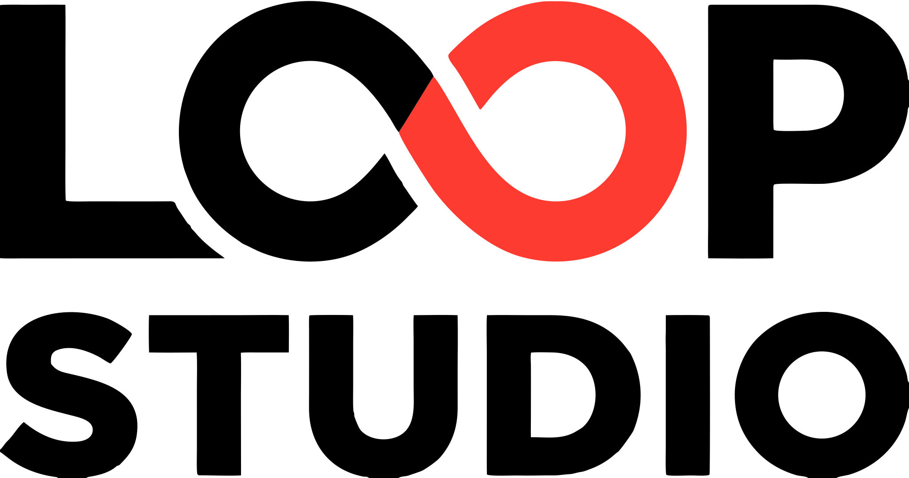
</picture>


**Full-page homepage concepts for local businesses.<br>Each one designed as if it were the only one on the street.**

[](https://vetrine.theloopstudio.org/)
[](https://github.com/Loop-Studio-Web/vetrine/actions/workflows/deploy.yml)
[](https://astro.build)
[](#the-checklist-every-window-passes)
[](#the-checklist-every-window-passes)

[**Walk the street →**](https://vetrine.theloopstudio.org/)

<sub>The entrance page follows the studio's own brand; each window behind it keeps its own identity.</sub>

</div>

<br>

## The street

*Vetrine* is Italian for **shop windows**. That is the whole idea: a shop window has one job, to make a stranger stop. So every concept here is a complete homepage with its own mood, structure, typography and motion, grouped by business category (Food & drink first), with several archetypes inside each category.

> [!NOTE]
> The pages are in Italian, because that is the audience they are built for (Hot Swap is the one exception: a computer store written in English, as many such shops are). All businesses, people, addresses and reviews are fictional and declared as such.

**A street, not a grid.** Each row sits in a full-width scene drawn in CSS and generated SVG (no image files): sky, two layers of skyline with lit windows, lamp posts, pavement and road, with a light parallax on scroll (off with reduced motion). The dark theme is night, the light theme is day, and every category has its own hour: restaurants at dusk, wellness at dawn, tech in the dead of night (windows lit like screens), studios in clear daylight, and the "in progress" rows under grey skies with a crane.

**How the entrance is organised.** The street is grouped by category: one labelled row of windows per category (a horizontal scroller on phones, with a neon arrow hinting that it moves), and categories still without a concept collect in a final "coming soon" row. Below it, the full list can be filtered by category (the filter lives in the URL hash, so it can be shared) and every concept has an indexable detail page at `/<category>/<archetype>/info/` that explains the idea, who it is for and what is inside. The concepts themselves stay `noindex`. Links from the hub to a concept open in a new tab, so the street stays open while visitors explore.

<br>

### 01 · Trattoria del Borgo

<a href="https://vetrine.theloopstudio.org/ristorazione/trattoria/">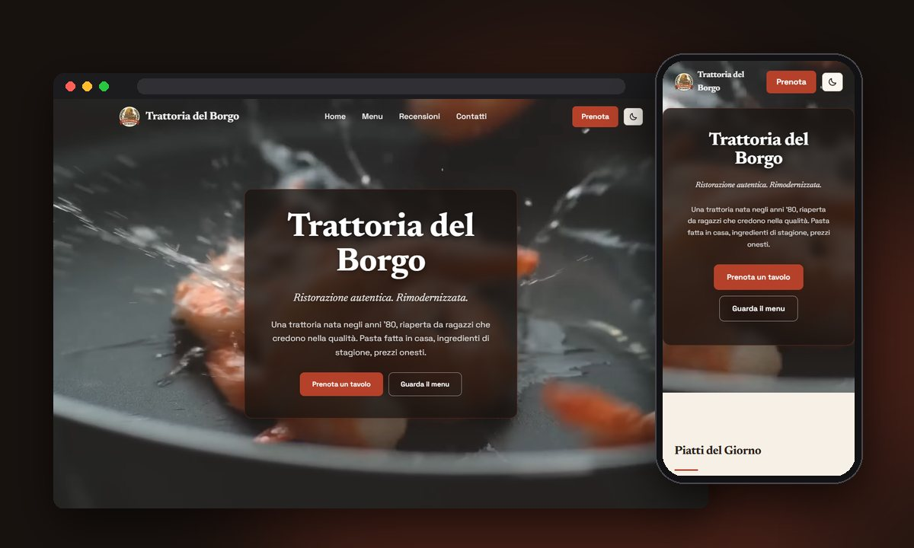</a>

*Honest food, rebuilt for today. Quality without airs.*

| | |
|---|---|
| **Archetype** | The neighbourhood trattoria: warm, young, unpretentious |
| **Mood** | Daylight, terracotta, paper. Light and dark themes with a switcher |
| **Type** | Newsreader for voice, Space Grotesk for everything else |
| **Palette** | 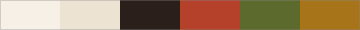 |
| **Signature moves** | Fullscreen video hero with a poster fallback, a "from the kitchen" diary feed, a sample-reviews widget, a table-booking flow, an illustrated SVG map |
| **Lighthouse** | 99 performance on mobile, 100 on accessibility and best practices |

[**Open Trattoria →**](https://vetrine.theloopstudio.org/ristorazione/trattoria/)

<br>

### 02 · Ossidiana

<a href="https://vetrine.theloopstudio.org/ristorazione/grande-ristorante/">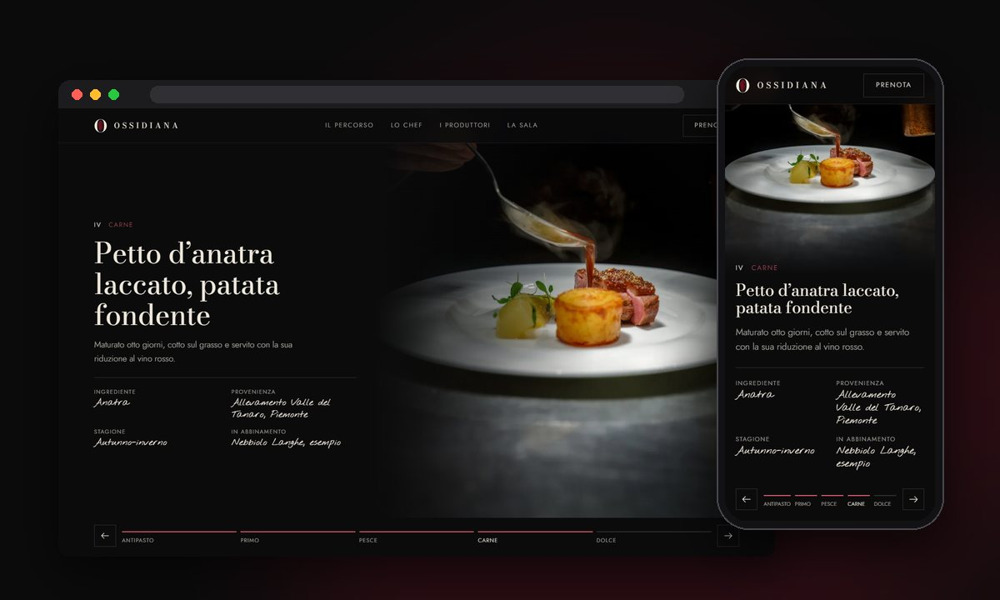</a>

*A dinner in five acts, in a room that stays dark. The light only goes where the plate is.*

| | |
|---|---|
| **Archetype** | The fine-dining tasting-menu restaurant: quiet, theatrical, precise |
| **Mood** | A dark dining room lit one course at a time. Dark only, on purpose |
| **Type** | Bodoni Moda for titles, Jost for text, and an ink-pen script for the chef's notes (ingredient, origin, pairing) |
| **Palette** | 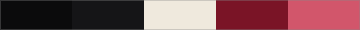 |
| **Signature moves** | A spotlight that follows the cursor (and drifts on its own on touch), a five-course journey on native scroll-snap with edge hints, a very slow in-view zoom on every photo, an "Atlante" of producers with an SVG map and season tabs |
| **Lighthouse** | 97 performance on mobile, 100 on desktop, 100 on accessibility and best practices |

[**Open Ossidiana →**](https://vetrine.theloopstudio.org/ristorazione/grande-ristorante/)

<br>

### 03 · Luppolo & Watt

<a href="https://vetrine.theloopstudio.org/ristorazione/ristopub/">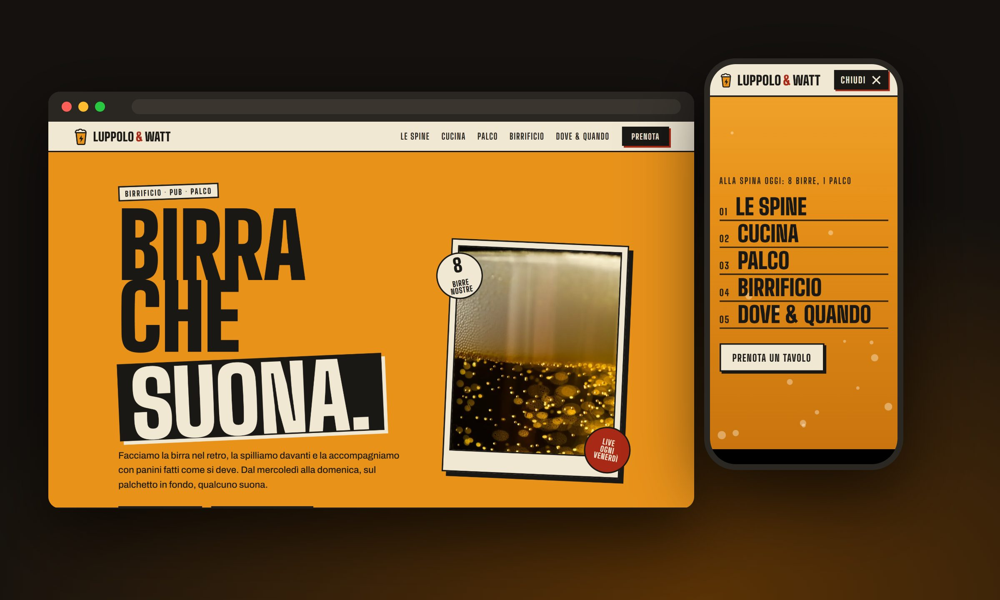</a>

*Beer that plays. Eight taps brewed in-house, sandwiches eaten by hand, live music on the small stage.*

| | |
|---|---|
| **Archetype** | The brewpub with a stage: loud, warm, a little rough |
| **Mood** | A beer label crossed with a gig poster: kraft paper, amber, ink, hard offset shadows. One light theme with a dark "stage" section |
| **Type** | Big Shoulders Display for titles, Archivo for text |
| **Palette** | 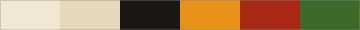 |
| **Signature moves** | A mobile menu that *pours*: the panel fills with beer from the bottom, with foam and bubbles. A tap board with filters and expandable beers (a glass that fills, bitterness and strength bars). "Goes with…" links from each dish that open the right beer. A gig calendar computed from today, so it never goes stale, whose "Book" button pre-fills the booking form. A fermenter that fills while a day counter climbs. A beer-mug cursor companion (mouse only) and a sub-second pour-the-logo intro, once per session |
| **Lighthouse** | 99 performance on mobile, 100 on desktop, 100 on accessibility and best practices |

[**Open Luppolo & Watt →**](https://vetrine.theloopstudio.org/ristorazione/ristopub/)

<br>

### 04 · Bottega Tre Rasoi

<a href="https://vetrine.theloopstudio.org/benessere/barbiere/">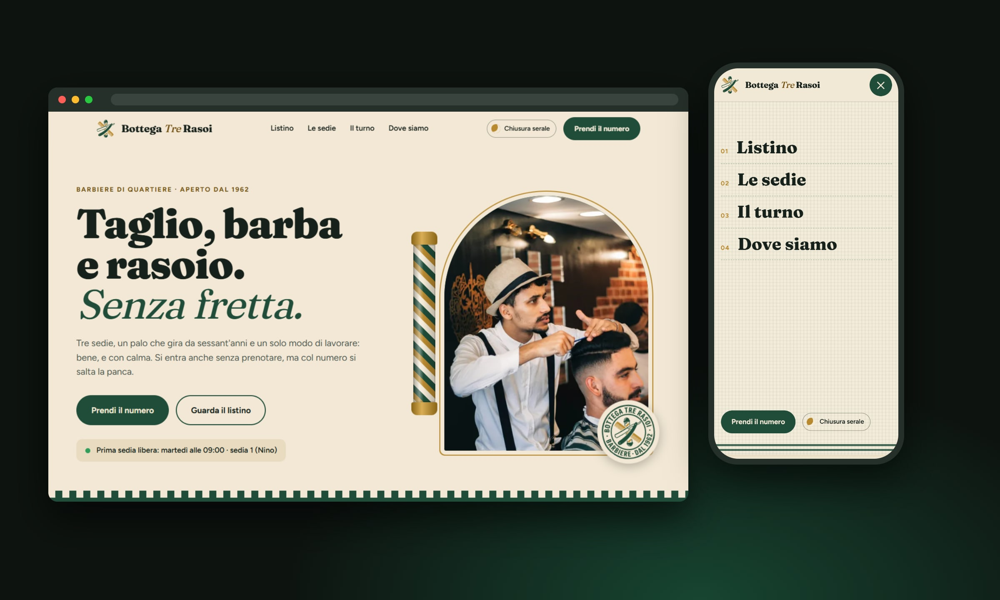</a>

*Cut, beard and razor, without hurry. You take a number, like at the shop.*

| | |
|---|---|
| **Archetype** | The neighbourhood barber: the **low-key** tier of the Beauty & wellness window |
| **Mood** | A bright shop, not a hipster cliché: cream, bottle green and brass, a striped pole, a price board on the wall. A dark "closing time" theme on a switch |
| **Type** | Fraunces for titles, Figtree for text |
| **Palette** | 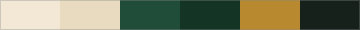 |
| **Signature moves** | Booking *by turn*: pick service, chair, day and time, then a numbered ticket is "printed" with the summary. Three numbered chairs, also pinned on the photo of the room, each with the next free slot computed from today. A mobile menu that unrolls like a hot towel. A pointer that *is* a pair of scissors (half open, wide open on links, shut while pressing) and a scrollbar striped like the pole |
| **Lighthouse** | 95 performance on mobile, 100 on desktop, 100 on accessibility and best practices |

[**Open Bottega Tre Rasoi →**](https://vetrine.theloopstudio.org/benessere/barbiere/)

<br>
### 05 · Atelier Lumen

<a href="https://vetrine.theloopstudio.org/benessere/estetica/">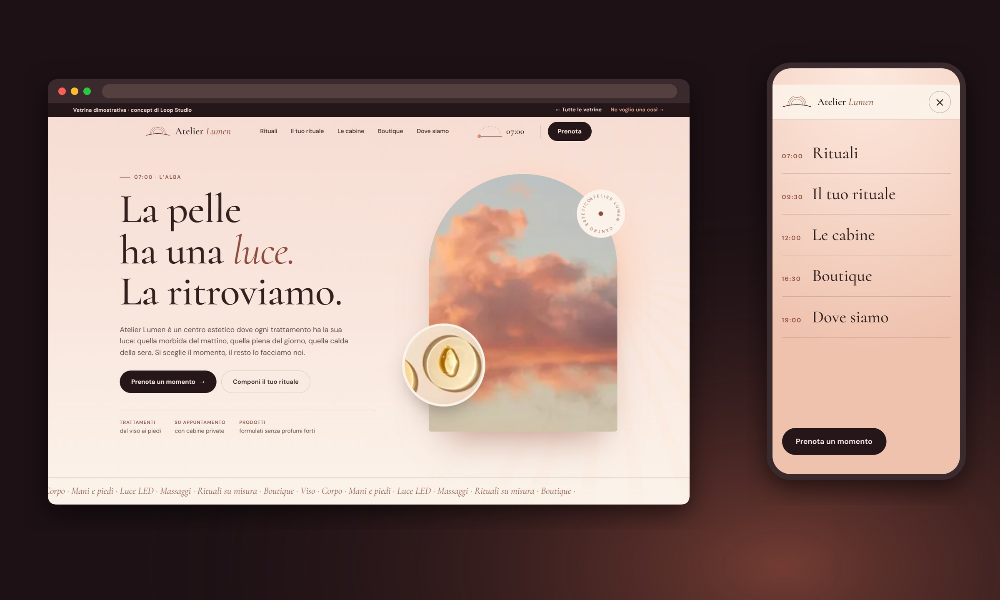</a>

*Skin has a light. We find it again. You choose the moment, we do the rest.*

| | |
|---|---|
| **Archetype** | The beauty centre built around light: the **medium** tier of the Beauty & wellness window, a step up in motion and interaction from the barber |
| **Mood** | One day of light, dawn to evening: powder pink, peach, ivory, rose gold and plum. Every section has its own hour and its own colours |
| **Type** | Cormorant for titles, DM Sans for text |
| **Palette** | 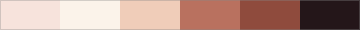 |
| **Signature moves** | A **bespoke ritual builder**: three choices (skin, time, what you want) recompose the treatment step by step, with duration, price and a changing colour of light, and the result lands pre-selected in the booking form. A sundial in the nav that reads the hour from how far you have scrolled, and a halo of light that follows the mouse. Treatment cards that tilt in 3D with a moving sheen, filtered by zone. Three cabins that expand one at a time. Booking by *bands of light* with a sun crossing the sky and a printed "ticket of light". A mobile menu that opens like curtains onto the light |
| **Lighthouse** | 99 performance on mobile, 100 on desktop, 100 on accessibility and best practices |

[**Open Atelier Lumen →**](https://vetrine.theloopstudio.org/benessere/estetica/)

<br>


### 06 · Aeterna

<a href="https://vetrine.theloopstudio.org/benessere/longevity/">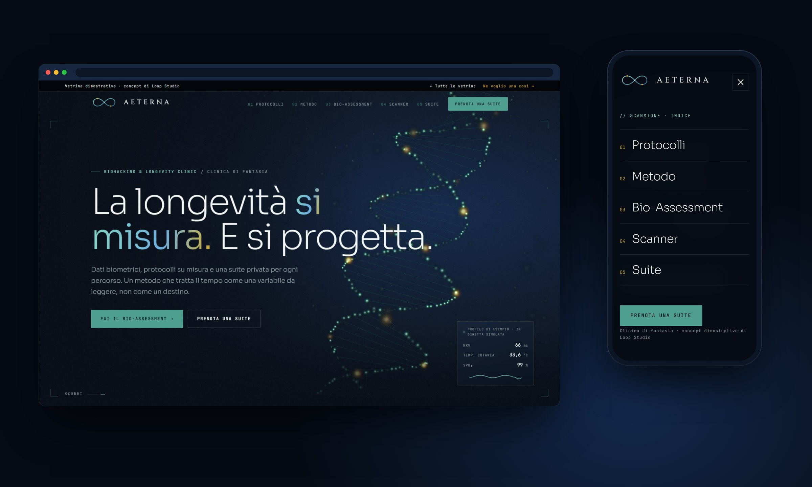</a>

*Longevity is measured, and it is designed. A DNA helix in 3D, a bio-assessment and a suite to book.*

| | |
|---|---|
| **Archetype** | The longevity clinic: the **high-key** tier of the Beauty & wellness window, where the budget buys real-time graphics, more code and more interaction than the barber and the beauty centre |
| **Mood** | A laboratory at night: abyss blue, emerald and a thread of gold, with pale "ice" sections as rhythm. Dark by choice |
| **Type** | Instrument Serif for titles, Montserrat for text and labels, JetBrains Mono for technical data, Cinzel for the wordmark only |
| **Palette** |  |
| **Signature moves** | A **WebGL DNA helix** (Three.js, custom GLSL: chromatic dispersion on every point, depth of field, repulsion from the pointer, inertia) that unwinds as you scroll, with an SVG poster for slow phones and no-WebGL. A pinned section whose protocols **scroll sideways** while you scroll down, each with a technical drawing and a **magnifying lens** that follows the mouse. A **four-step bio-assessment** whose radar chart redraws live on every answer and ends in a report that pre-fills the booking. A **before/after cellular scanner** drawn in canvas, with a draggable blade of light and live readouts. A **suite booking** with real-time price and a side drawer. Magnetic buttons, a contextual cursor ring, glass cards lit by the pointer, a laser-scan mobile menu. Smooth scrolling on desktop only, never on touch |
| **Lighthouse** | 90 performance on mobile, 96 on desktop, 100 on accessibility and best practices. A short preloader runs on every load and covers the helix being prepared: Three.js downloads at once and the shaders compile asynchronously (`compileAsync`), so the title animation never competes with them. On phones Three.js loads only after the first touch |

[**Open Aeterna →**](https://vetrine.theloopstudio.org/benessere/longevity/)

<br>

### 07 · FIXLAB

<a href="https://vetrine.theloopstudio.org/tech/riparazioni/">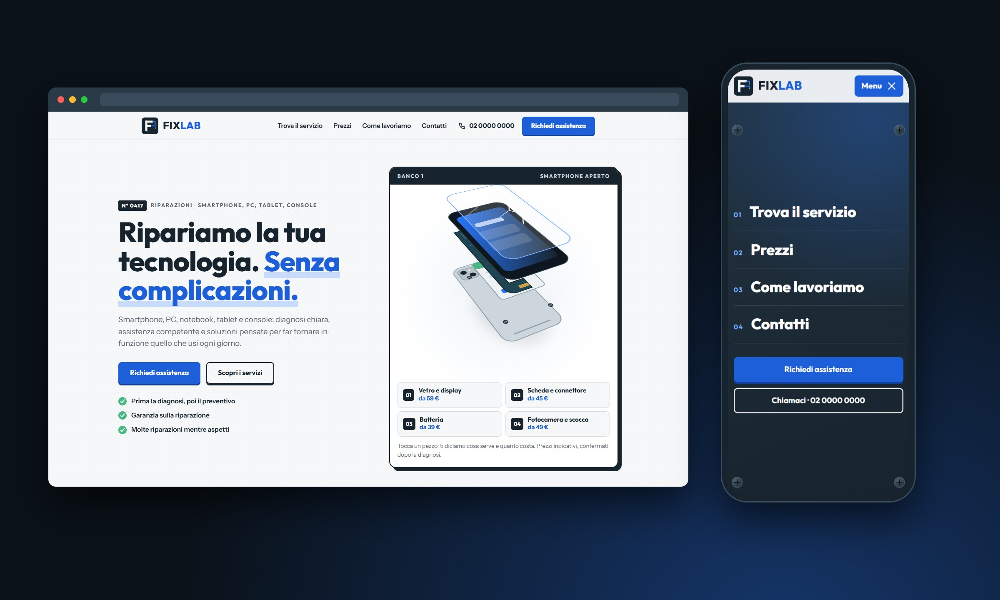</a>

*Technology breaks. We put it back to work. The page is a repair job card.*

| | |
|---|---|
| **Archetype** | The neighbourhood repair lab (phones, PCs, tablets, consoles): the **low-key** tier of the Tech window. Plain, quick, built to turn a visit into a request |
| **Mood** | An honest workshop with a well-made website: ice white, midnight blue, and an electric blue used as an accent, never as the main colour. Light theme only |
| **Type** | Outfit for titles, Instrument Sans for text (no futuristic or gaming faces) |
| **Palette** | 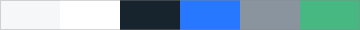 |
| **Signature moves** | The whole page reads as a **repair job card**: numbered fields, a tag with a tear-off stub, a receipt. An **exploded smartphone in pure CSS 3D** where every part is a service with its "from" price and a tap pre-fills the finder. **Find the service in two taps** (device, then problem) builds the job card with price, time and steps from one data file that also feeds the price list and the request form. A **repair tracker** that fills a five-step bar from a demo code. A request form with real error messages and a receipt, an illustrated map and an "open now" badge computed from the visitor's clock. On phones a fixed call / request bar and a menu that is the **back panel of a phone, with four screws that turn out** as it opens. No photos at all: everything is SVG and CSS |
| **Lighthouse** | 100 performance, accessibility and best practices on mobile and desktop. The two fonts are preloaded, which removed a layout shift on the hero |

[**Open FIXLAB →**](https://vetrine.theloopstudio.org/tech/riparazioni/)

<br>

### 08 · Hot Swap

<a href="https://vetrine.theloopstudio.org/tech/pc-gaming/">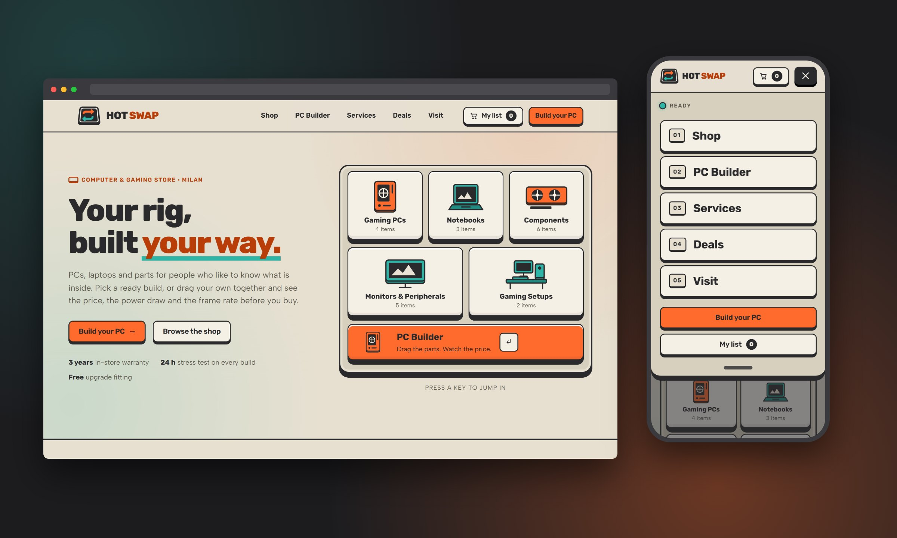</a>

*Your rig, built your way. Every button is a key that goes down when you press it.*

| | |
|---|---|
| **Archetype** | The computer and gaming store (PCs, laptops, components, peripherals): the **medium** tier of the Tech window. Written in English on purpose, the only concept that is |
| **Mood** | A mechanical keyboard in a "colorway": beige case, graphite, orange and teal, with buttons that have real thickness and sink when pressed. Light theme only, no photos |
| **Type** | Rubik for titles, Albert Sans for text |
| **Palette** | 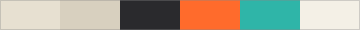 |
| **Signature moves** | A **PC builder with real rules**: drag parts into the bays of a case (mouse, pen, or a handle on touch), with socket, memory type, card length and power supply checked live, a budget, an FPS estimate for four made-up games and a receipt with a code. A **shop** whose filters animate with FLIP, with search, sort, quick look and a compare tray for up to three products. A **list that runs to the counter**: products, services, deals and the build land in one drawer, then a pickup day and hour are chosen from the shop's real opening hours (Rome time) and the ticket shows up in the Visit section too. Services that suggest themselves from what is in the list, **daily deals** that rotate and count down to midnight, an "open now" badge, an animated sketch map, and a phone menu that is a hot-swap tray with an LED that turns green |
| **Lighthouse** | 99 performance on mobile, 100 on desktop, 100 on accessibility and best practices, zero layout shift |

[**Open Hot Swap →**](https://vetrine.theloopstudio.org/tech/pc-gaming/)

<br>

### 09 · Ordito

<a href="https://vetrine.theloopstudio.org/tech/studio/">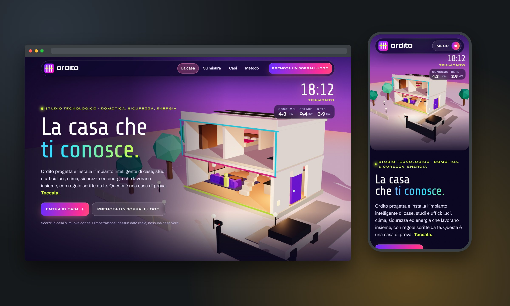</a>

*The house that knows you. A 3D house you can touch, in full colour.*

| | |
|---|---|
| **Archetype** | The technology studio for homes and offices (home automation, security, energy): the **high-key** tier of the Tech window, where the budget buys real-time 3D and a more ambitious interaction |
| **Mood** | **Aurora**: ink-violet black, electric violet, magenta, cyan and acid lime. Colour is light: the sky of the house goes from pink dawn to cyan day, magenta dusk and a violet night with stars, and tints the buttons and cards of the whole page. Below the house, full-width blocks of flat colour (magenta, lime, violet, cyan). Glass, grain, glowing edges and a scrolling ticker |
| **Type** | Share Tech for the main headline and the clock, Syne for section titles, Schibsted Grotesk for text (no mono, no serif) |
| **Palette** | 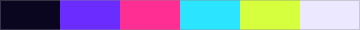 |
| **Signature moves** | A **3D house built only from simple shapes** (Three.js, no model files) in a pinned stage: scrolling flies the camera from room to room, and every panel on the left changes the scene for real. A **clock** moves the sun across the sky (colour of the sky, shadows, windows, exposure) and five scenes (morning, arrival, dinner, night, holiday) set lights, blinds, heating, alarm, lock and presence together, with **kW consumed, produced and drawn from the grid** computed from the same state. **Rules written inside a sentence** ("When I get home and it is evening, then turn on the living-room lights"), not dragged as blocks, then a simulated day runs and shows when each rule fires. A **made-to-measure specification** (type, size, areas) priced live on a perforated ticket. A **floating glass navigation pill** and a mobile menu that opens like a colour curtain. Three **case studies that open full-screen** with a View Transitions morph of the floor plan. On phones the 3D scene starts on the first touch, with a poster in its place |
| **Lighthouse** | 99 performance on mobile, 100 on desktop, 100 on accessibility and best practices, zero layout shift. Three.js is a dynamic import (on desktop after idle, on phones after the first interaction); the stage shows a pre-rendered poster until it is ready and falls back to it without WebGL |

[**Open Ordito →**](https://vetrine.theloopstudio.org/tech/studio/)

<br>

### 10 · Sifone

<a href="https://vetrine.theloopstudio.org/casa/idraulico/">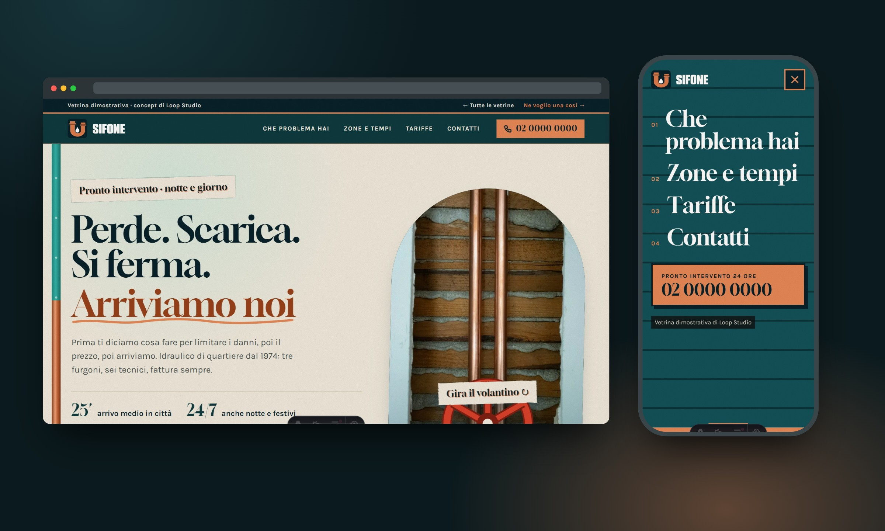</a>

*Leaks, drains, boilers: we are on our way. A valve you turn to open the emergency.*

| | |
|---|---|
| **Archetype** | The emergency plumber (a trade on call): the **low-key** tier of the Home & trades window, where the goal is to get the phone to ring fast |
| **Mood** | Petrol blue, copper and lime-wash white. Real photography (copper pipes, an old tap, workshop tools), paper grain, and a hand-painted sign whose second colour is off-register. Cut-corner copper plates instead of boxes: the page is a workshop that works with real pipes |
| **Type** | Gloock for headlines, Karla for text |
| **Palette** | 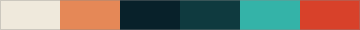 |
| **Signature moves** | A **valve wheel** you drag or tap in the hero: the pipe fills with water and the number to call appears. A **pipe along the side of the page** that fills as you scroll, with a flange at every section. **What to do right now** for four problems (a checklist, time, a "from" price, a button that prefills the form), a **pressure gauge** for arrival times over a schematic of the served zones, a **rolling-digit meter** for the cost estimate (day, night or holiday, hours of work), a request form with clear errors and a **receipt**. The mobile menu is a **rolling shutter** that comes down, with a close button inside it. A fixed call/request bar on phones |
| **Lighthouse** | 98 performance on mobile, 100 on desktop, 100 on accessibility and best practices, no layout shift. Three free Unsplash photographs (no faces, no brands), the rest is SVG and CSS |

[**Open Sifone →**](https://vetrine.theloopstudio.org/casa/idraulico/)

<br>

### 11 · Obra Fina

<a href="https://vetrine.theloopstudio.org/casa/ristrutturazioni/">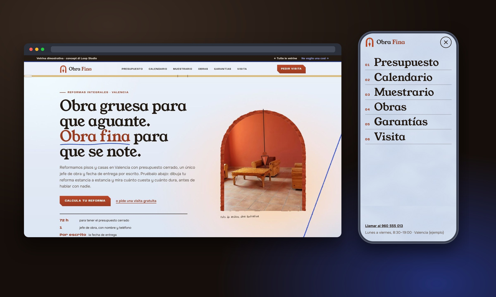</a>

*Obra gruesa para que aguante. Obra fina para que se note.* A house in cross-section you can touch, room by room.

| | |
|---|---|
| **Archetype** | The renovation company (full-home refurbishment): the **evolved** tier of the Home & trades window, where the page does part of the sales visit before anyone calls. **Written in Spanish, for Spain**, the only other concept outside Italian after Hot Swap |
| **Mood** | Lime wash tinted with *azulete* (the blue of whitewashed houses), terracotta, sepia and one chalk blue, the mason's line. Soft light gradients in OKLCH that move across the wall as you scroll, plaster edges that look trowelled, hand-drawn encaustic tiles. The scroll progress is a **spirit level** with a bubble |
| **Type** | Young Serif for headlines (it echoes the lettering of the logo), Onest for text, Anybody (variable width, stretches as a section scrolls into view) for the site-hoarding labels, Covered By Your Grace for pencil notes |
| **Palette** |  |
| **Signature moves** | A **house in cross-section drawn in CSS** with seven rooms: tap one, choose how much work it needs (none, refresh, renovation, full) and its walls are repainted with a **trowel-pass wipe**; three layers (structure, installations, finishes) swap through a **View Transitions** wipe. Sliders styled as a mason's ruler, extras per room and a **site receipt** that prices every line, splits the cost into rough work, installations and finishes, adds Spanish 10 % renovation VAT and gives an honest range. A **Gantt chart computed from the same choices** (phases, weeks, start and delivery date, whether you can keep living at home). Eight **encaustic tiles as hand-made SVG** that lay themselves in a perspective room and change the floor of the estimate. Before/after sliders with a **swinging plumb bob**, a contract-style warranty sheet with an ink stamp that lands, a chalkboard of reviews, and a visit booking with days computed from today and a receipt. Modern CSS used for real: scroll-driven animations, `@property`, `color-mix()`, `field-sizing`, the mask zigzag edge. The mobile menu is **three trowel passes** of plaster colour. A fixed call/visit bar on phones |
| **Lighthouse** | 94 performance on mobile, 100 on desktop, 100 on accessibility and best practices, no layout shift. Photographs are free Unsplash archive pictures, the rest is SVG and CSS; mobile performance is the lowest of the street because of its large heroes of gradients and plaster filters |

[**Open Obra Fina →**](https://vetrine.theloopstudio.org/casa/ristrutturazioni/)

<br>

### 12 · Scala Vera

<a href="https://vetrine.theloopstudio.org/casa/interior/">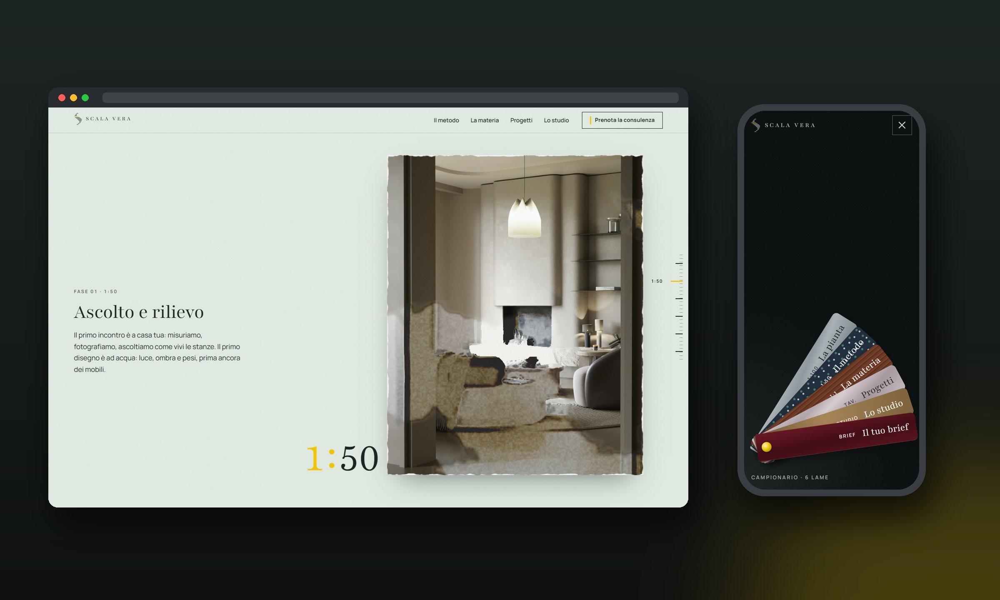</a>

*Ogni casa ha la sua scala giusta.* Every home has its right scale. A project told by scrolling down the scales, from 1:100 to 1:1.

| | |
|---|---|
| **Archetype** | The interior design studio: the **experience** tier of the Home window, where the homepage shows the method before the portfolio |
| **Mood** | Green-grey tracing paper that darkens, scale after scale, into graphite and basalt. Ink, grey-taupe renders and a single accent, the yellow of a folding rule, never used as text on light backgrounds. Stone, wood, bronze, lacquer and velvet bring the colour |
| **Type** | Playfair (the variable version with an optical-size axis from 5 to 1200, not Playfair Display) for headlines: the big scale number changes optical size together with the drawing, sturdy at 1:50, hairline at 1:1. Manrope for text, labels and dimensions |
| **Palette** |  |
| **Signature moves** | **No libraries**: two WebGL2 engines written for this page. A **floor plan in SVG that draws itself** with the pen, then zooms into the living room. **The descent of scales**: a sticky sheet where the render passes through a hand-made **watercolour filter** (Kuwahara with a noise-rotated kernel, pigment as absorption, wet edges, paper granulation) that **dries in patches** leaving a tide line, then **match cuts aligned on the travertine table**, the next sheet landing on top with a deckled edge and a shadow, down to the stone. Native scroll, never hijacked: the scene follows it with a critically damped spring. A **materials library with raking light** (normal + roughness maps of CC0 scans, a sheen term for velvet, procedural brushed bronze with anisotropic highlights and lacquer with a clear coat) lit by a torch that follows the cursor or the finger. **Restyle the photo**: wall, stone shelf and side tables masked on the render, lime-wash colours or library materials that keep the render's own light and shadows, spread like a roller pass from where you drop them (drag a sample onto the photo, hold to see the original). Three projects laid out as presentation sheets, one with three colour proposals for the same room. A brief that builds your **materials board** from the library and ends with a title-block receipt. The mobile menu is a **fan deck of material samples** on a brass pin |
| **Lighthouse** | 86–88 performance on mobile (text LCP held back by the variable serif), 100 on desktop, 100 on accessibility and best practices, no layout shift. The WebGL engines start only when their section comes into view. Images are free Unsplash renders declared as project renders, textures are CC0 from ambientCG and Poly Haven |

[**Open Scala Vera →**](https://vetrine.theloopstudio.org/casa/interior/)

<br>

### Next on the street

| Category | Archetype | Status |
|---|---|---|
| Legal & professional | to be decided | Planned |
| Local shop / e-commerce | to be decided | Planned |

No deadlines: one window at a time, with the care each one needs.

<br>

## The one rule

> [!IMPORTANT]
> **Nothing is shared between concepts.** Not a component, not a layout, not a stylesheet, not a font pairing.
>
> This repository is only infrastructure: one `package.json`, one build, one deploy. It is **not** a design system, and that is deliberate. The failure mode we are avoiding is *N concepts that are really the same site wearing different colours*.

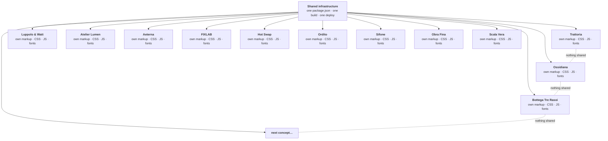

A piece of code is reused between two concepts only when it is the *exact same technical problem solved the exact same way*, never as a principle. Each concept is free to pick its own technique: plain CSS, vanilla JS, or a framework as an Astro island, whatever that page needs.

<br>

## The checklist every window passes

Before a concept goes on the street, it has to clear the same gate:

| Gate | What it means | Trattoria | Ossidiana | Luppolo & Watt | Tre Rasoi | Lumen | Aeterna | FIXLAB | Hot Swap | Ordito | Sifone | Obra Fina | Scala Vera |
|---|---|:-:|:-:|:-:|:-:|:-:|:-:|:-:|:-:|:-:|:-:|:-:|:-:|
| **Builds** | `astro build` is clean | ✅ | ✅ | ✅ | ✅ | ✅ | ✅ | ✅ | ✅ | ✅ | ✅ | ✅ | ✅ |
| **Accessible** | `axe-core`: zero violations | ✅ | ✅ | ✅ | ✅ | ✅ | ✅ | ✅ | ✅ | ✅ | ✅ | ✅ | ✅ |
| **Narrow** | No horizontal scroll at 390 px | ✅ | ✅ | ✅ | ✅ | ✅ | ✅ | ✅ | ✅ | ✅ | ✅ | ✅ | ✅ |
| **Menu on phones** | A real menu with its own open/close effect, keyboard and Escape friendly (a curtain for Ossidiana, an unrolling card for the Trattoria, a pour of beer for Luppolo & Watt, a hot towel for Tre Rasoi, curtains for Lumen, a laser scan for Aeterna, a screwed-on back panel for FIXLAB, a tray with an LED for Hot Swap, a dark room whose lights come on one by one for Ordito, a rolling shutter for Sifone, three trowel passes for Obra Fina, a fan deck of material samples for Scala Vera) | ✅ | ✅ | ✅ | ✅ | ✅ | ✅ | ✅ | ✅ | ✅ | ✅ | ✅ | ✅ |
| **Interactive** | Widgets are exercised end to end (forms, tabs, keyboard) | ✅ | ✅ | ✅ | ✅ | ✅ | ✅ | ✅ | ✅ | ✅ | ✅ | ✅ | ✅ |
| **Shareable** | A 1200×630 `og:image` that previews properly | ✅ | ✅ | ✅ | ✅ | ✅ | ✅ | ✅ | ✅ | ✅ | ✅ | ✅ | ✅ |
| **Discreet** | `noindex, nofollow`, fictional data, no third-party logos | ✅ | ✅ | ✅ | ✅ | ✅ | ✅ | ✅ | ✅ | ✅ | ✅ | ✅ | ✅ |

```text
 LIGHTHOUSE · mobile            Trattoria                Ossidiana
 Performance      ████████████████████  99   ███████████████████▌  97
 Accessibility    ████████████████████ 100   ████████████████████ 100
 Best practices   ████████████████████ 100   ████████████████████ 100
 SEO              ████████████▌         63   ████████████▌         63
                  SEO is 63 on purpose: every page ships noindex.
```

<br>

## Behind the counter

**Stack:** [Astro](https://astro.build) (static output), plain CSS with scoped styles, small vanilla-JS scripts per section, images optimised by `astro:assets`. Hosted on GitHub Pages at [vetrine.theloopstudio.org](https://vetrine.theloopstudio.org/).

```text
src/
├─ pages/
│  ├─ index.astro                      the public hub (see src/hub/)
│  ├─ ristorazione/
│  │  ├─ trattoria/index.astro         page shell only
│  │  ├─ grande-ristorante/index.astro
│  │  └─ ristopub/index.astro
│  ├─ benessere/
│  │  ├─ barbiere/index.astro
│  │  ├─ estetica/index.astro
│  │  └─ longevity/index.astro
│  └─ tech/
│     ├─ riparazioni/index.astro
│     ├─ pc-gaming/index.astro
│     └─ studio/index.astro
├─ hub/                                data, styles and sections of the hub page
├─ concepts/
│  ├─ trattoria/                       one component per section + base.css
│  ├─ ossidiana/                       same idea, different everything
│  ├─ ristopub/                        and again
│  ├─ barbiere/                        and again
│  ├─ lumen/                           and again
│  ├─ aeterna/                         and again, with WebGL
│  ├─ fixlab/                          and again, with no photos at all
│  ├─ hotswap/                         and again, in English
│  └─ ordito/                          and again, with a 3D house
└─ assets/<concept>/ and hub/          local images only, no hotlinking
public/images/<concept>/               fixed URLs: og:image, favicon
docs/img/                              the pictures you are looking at
```

**Conventions**
- One component per section, with its own markup, scoped CSS and JS.
- Images live in the repo and go through `<Image>`; photos come from Unsplash's free library and are checked for watermarks.
- Every internal URL goes through the configured `base`, otherwise links break on GitHub Pages.
- Reviews and booking widgets are re-created inside each concept with its own styling, never imported.

**Run it**

```bash
npm install
npm run dev        # http://localhost:4321/
npm run build      # static output in dist/
npm run preview    # serve the production build locally
```

Node 22.12 or newer.

**Deploy:** every push to `main` triggers a GitHub Actions workflow that builds the site and publishes it to GitHub Pages. There are no manual steps. The site lives on its own domain (a `CNAME` record on Cloudflare pointing at GitHub Pages), so `astro.config.mjs` sets `site` to that domain and `base` to `/`.

<br>

## Fine print

- 🎭 **Everything is fictional.** Names, addresses, phone numbers, chefs, producers and reviews are invented and labelled as examples. Review widgets carry no third-party branding.
- 🔒 **Nothing leaves the page.** Booking forms are demonstrations: no data is sent or stored.
- 🙈 **Concepts stay out of search engines.** Every concept page is `noindex, nofollow`; only the entrance page is indexable.
- 📷 **Photos** are from [Unsplash](https://unsplash.com) and used under its licence. Brand marks and emblems are AI-assisted concepts created for these demos.

<br>

## The studio

<div align="center">

<picture>
  <source media="(prefers-color-scheme: dark)" srcset="docs/img/loop-logo-on-dark.svg">
  
</picture>

**Website, content and social: three services, one loop.**

[theloopstudio.org](https://theloopstudio.org/) · [Lab: experiments and components](https://github.com/Loop-Studio-Web/lab)

<sub>&copy; 2026 Loop Studio. All rights reserved: the source is public to show our work, not to be reused (see [LICENSE](LICENSE)). Want a window like these for your business? [Get in touch](https://theloopstudio.org/contatti/).</sub>

</div>
